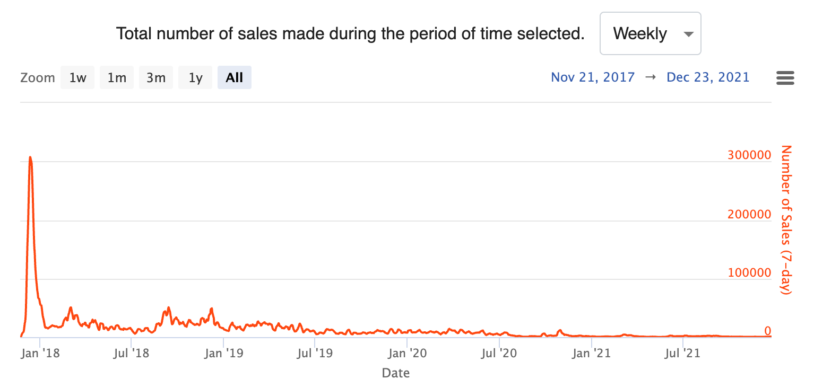

# 2022 预测

我如何成为更好的决策者？在信息不断增加的世界中，过滤来源、检查认知偏差并从假设中收集有用数据变得越来越困难。在我深入研究 2022 年的预测之前，请先了解一组在过去一年中对我产生影响的决策框架和想法。

* 双向与单向决策：有些决策是可逆的。其他不是。以高度的信念做出不可逆转的决定，以即使较低的信念做出可逆的决定。
* 90% 的事情都是废话：预测不会发生的事情比预测会发生的事情容易得多。专注于可能正确的事情。
* 决策中的偏差和噪音：决策中的错误有两个维度：偏差在同一方向上产生错误，噪音是应该相同的判断中的可变性。分离和分类每种类型的错误对于检验假设和进行更正至关重要。

因此，当我猜测 2022 年会发生什么时，我将尝试仔细思考这些想法。目标不是诺查丹玛语言一般的准确性，而是明年反思的机会，以磨练我的决策技巧。

## 高度可信

> 1. 远程开发成为主流。

公司（更低的成本，更安全）和最终用户（更低的摩擦）之间存在一致性。大多数 FAANG 已经这样发展了。微软正在通过 vscode-server 的开源和 GitHub 的原生代码空间功能积极推动用户实现这一目标。最后，浏览器作为操作系统的趋势为新开发人员的加入创造了有利条件。更不用说持续的在家工作趋势了。

写作：

* 远程开发者环境再次变酷（有点）
* 开发者浏览器
* IDE 作为平台

对于谁赢得这一趋势，我没有任何关系。最好的发行版通常会获胜，而微软拥有它（像往常一样）。Replit 正在创建一个有趣的替代方案，但它的用户类型和重点都错误。企业 SaaS 就像 Gitpod 一样，而 Coder 无法通过销售微软的开源产品来与微软竞争（而 MSFT 免费赠送它）。

> 2. 所有权为王。一切资产证券化。

市场将为几乎所有事物创建。这些市场中的大多数将没有流动性并且会消亡，但有一些市场会存活下来。最成功的将是实物资产的证券化，而最抽象的将无法随着时间的推移保持动力。目前，这些证券中的许多都是建立在加密货币网络上的，但我认为这对大多数用例来说并不重要。事实上，建立区块链将简化大多数这些证券。

写作：

* 二十一世纪的所有权
* 直接注册系统

作为一个较低的信念赌注，我预测围绕这个问题会有新的监管，特别是与作为证券的代币有关。至于这是否会是好的政策，待定。这些市场确实需要被监管--最佳出价/报价、洗牌交易、KYC/AML，以及纯粹的骗局。有了正确的监管，我们都会好起来的。

> 3. 随着数据分析栈和数据科学栈的整合，Databricks和Snowflake成为直接竞争对手

这在某种程度上已经发生了，因为数据仓库和湖库架构发生了碰撞（为什么你需要在S3上面有两个独立的可查询存储？） 已经有关于数据科学家之死的存在性讨论。这是结束吗？是松绑了吗？

写作：

* 机器学习操作（MLOps），融合还是分歧？
* Kubernetes极致主义
* 软件开发者的松绑
* 作为雪花的数据栈
* 工具链的蔓延

## 中型信念

> 1. SaaS的经济性变得没有吸引力。

在2010年代，SaaS公司与传统的永久许可证和内部部署的公司竞争。现在，SaaS公司越来越多地与其他SaaS公司竞争。由于超大规模公司向上层移动，云税增加，以及客户获取成本增加，利润率将下降。大多数公司的净值保留（NDR）将呈下降趋势，因为供应商的锁定被换成了更多的分配（例如通过开源、开放标准或数据主权）。 

写作：

* 净值保留率
* 云成本时代
  
> 2. 对不同的堆栈和开发者角色进行重新捆绑。

开发人员将根据一套共同的工具和责任被重新捆绑。市场希望如此，原因有几个：

* 雇用技术人才将越来越困难。远程公司与每个公司友好的时区竞争。更少的角色降低了招聘和培训的负担。
* 随着技术能力的分层，公司为建立一个仪表板的工程师和设计一个分布式系统的工程师支付同样的费用是没有意义的。

我相信市场最终会在三个层次上得到解决。以下是我认为随着时间的推移，它是如何发挥的。

数据分析师/数据科学家/数据库管理员（仪表盘/可视化）。知道SQL和开发级的Python。

数据工程师/DevOps工程师/网站可靠性工程师（管道/自动化）。知道脚本语言和自动化。可能知道通用的编程语言，如Go或C#，以编写自动化工具。主要集中在可观察性和监控方面。水暖云服务。

前端开发者/后端开发者/全栈开发者（核心系统）。设计产品架构。构建可扩展的系统选择或构建开发框架。

写作：

* 确定开发者工具的范围
* 软件开发者的松绑
  
> 3. NFT热潮结束。许多人被留在了没有买家的资产袋持有人的位置。

尽管我的一个较高信念的赌注是所有权，但这些市场中的许多将变成非流动性的。许多社区由代币经济驱动，有利于早期采用者，对资产的长期持有者不太有利。

上图是2021年的加密猫的市场。加密猫是2017年推出的原始NFT套装之一。今天的许多加密猫、猿猴、狮子、老虎和熊都是以惊人的方式设置的。

> 4. 云计算超大规模者提供最好的开发者用户体验

我不认为我们对AWS的开发者体验给予了足够的肯定。当然--仪表盘看起来像是2010年的。CloudFormation需要太长时间。有200多个服务，其架构相互重叠或纠结。但他们从根本上满足了客户的需求：可靠和可扩展的构建模块，可以很好地协同工作。

AWS和其他超大规模公司并不回避建立垂直SaaS解决方案。许多人已经预测了 "行业云"的兴起，如AWS/高盛的合作。最后，许多实验性的DevEx解决方案是建立在两个或三个超大规模服务的交集上的（Vercel/Netlify：CDN + EC2）。

写作：

* 开发者网络效应
* Netlify、Vercel和AWS Amplify
* 自上而下的JAMStack vs. 云
    
> 5. 大型科技公司会发现很难让员工回到办公室。没有设定强制性的回办公室日期。

这里有一个囚徒困境：如果所有的科技巨头都合作，决定让员工回到办公室，员工将没有选择。如果哪怕是一个人叛变，该公司就会从最好的远程工人中挑选。在大流行期间成立的初创公司将继续只做远程工作，尽管有些人可能会后悔。

我仍然认为拥有一个小型的联合办公团队是有优势的。许多公司会发现，远程并不比拥有一个办公室便宜多少（或者实际上，更贵）。远程招聘往往是全球招聘，这将给完全远程的公司带来重大挑战。更多的候选人需要筛选，更少的网络效应（推荐人、口碑等），放大最好的公司并惩罚其余公司的收益（逆向选择）。

## 信心不足

> 1. 利率会提高，通货膨胀增加。

宏观经济事件总是难以预测的，作为一个初创企业的计划也是无用的--但我这个想当宏观经济学家的人喜欢思考这个问题，以此为乐。这可能会导致SaaS倍数的收缩，除了最好的名字（这已经在发生）。BNPL会有一个巨大的削减。

> 2. Web 2.0公司被大公司收购。

同样，很难预测这些，但如果我们看到Pinterest、Twitter或Etsy被收购，我不会感到惊讶。随着苹果应用追踪透明度（ATT）规则改变游戏规则，电子商务堆栈的不同部分将被迫结合。支付+购物（Shopify / Pinterest）。企业B2B+通信（Salesforce / Twitter）。同时，电子商务解决方案将被拆分，因为有明显的赢家和输家。Etsy通过收购像Depop这样的小品牌和在大流行期间的电子商务加速，保持了活力。但在未来，我可以看到采取私有化交易来解开Etsy的一些品牌战略。

> 3. 加密货币监管即将到来。特别是针对稳定币。

美国证券交易委员会主席加里-根斯勒(Gary Gensler)一直很公开地表示，加密货币的监管属于美国证券交易委员会的任务范围，而且代币属于证券。Gensler在加密货币社区得到了很多仇恨，但他实际上对这个话题非常了解（他在麻省理工学院担任教授时，教过一门关于加密货币的热门课程）。

我认为Gensler想要监管是正确的。如果没有明智的监管，合法的公司就很难与彻头彻尾的骗局竞争。掠夺性的策略和未实现的利润承诺往往会排挤那些建设企业。每一个骗局或误导性项目都会侵蚀信任（我相信这正是大多数工程师对加密货币不信任的原因）。

> 4. 对Roblox的监管以及对其针对12岁以下儿童的激进微交易策略的调查。

围绕Instagram及其对儿童的影响的评论被夸大了。我们应该关注的真正做法是在Roblox。根据游戏的不同，用户每隔几分钟就会被提示有机会购买虚拟物品。25%的用户在9岁以下。50%的用户在12岁以下。在我看来，要求12岁以下的儿童用微交易付款似乎是一种掠夺。

最糟糕的是，它是有效的。2021年，Roblox报告每季度每个每日活跃用户的预订量为13.49美元。虽然大部分预订量很可能来自 "鲸鱼"，但有各种传闻表明，小孩子在这些游戏上花了大笔钱。

我不确定公众是否知道Roblox对儿童的营销到底有多积极，但当它不可避免地被曝光时，我认为会有一个监管反应。

Ref:

[2022 Predictions](https://matt-rickard.com/2022-predictions/)
