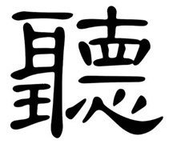

2021年的领导力学习

> TheVentury 的合伙人兼 IT 主管 Jakob Reiter 分享了他在过去一年中最有价值的领导力经验。个人的、亲密的、发自内心的。读一读，看看有没有什么东西能引起你的共鸣，甚至能激发你更深入地挖掘自己的学习。

2021 年是 COVID-19 大流行的第二年，这意味着，我们现在可以回顾两年并开始看到新出现的模式（请记住，一个永远不是模式，你至少需要两个）。这些新模式迫使我们改变我们的行为并重新思考我们的领导风格。

就个人而言，我在 TheVentury 的角色也发生了很大变化。在我的运营角色中，我从编程机器转向更进一步与人类合作。在你问之前：我喜欢它。这就是为什么我在假期里有一种冲动，想反思并写下过去一年中最具影响力的十项领导学习。然后我想：为什么不与他人分享以传播信息呢？所以他们在这里。我从 2021 年开始的主要个人学习：

1. 动荡时期的思考
2. 全心全意倾听人们的心声
3. 重新解释纪律
4. 不知道是最亲密的
5. 培养普罗诺亚
6. 重复你自己
7. 工程机缘巧合
8. 每个事物都有它的时代
9. 你如何将权力转移到信息上
10. 我身体里最美的器官

# 1. 在动荡时期思考

> 动荡时期最大的危险不是动荡。
> 而是按照昨天的逻辑行事。
> ——彼得·德鲁克

我们越深入大流行病，我们就越能看到游戏规则发生了变化。不仅仅是远程/混合工作，还有我们对组织中的敏捷性和自主性的重视程度。我们开始看到，超过一定时间跨度的中央计划只会变得过度模糊和不可预测。这就是为什么我们需要保持敏捷并拥抱变化。

## 1.1 在团队中

对我来说，这意味着我试图在远程设置中让团队更紧密地联系在一起，并促进对正在发生的事情的理解。我们在 MS Teams 中建立了一个站立交流频道，每个人都在开始新的一天时开始发布他们的站立交流。我们提出了这个解决方案，因为人们开始新一天的时间变化很大。程序员通常更喜欢在当天晚些时候开始，而项目经理更喜欢抢先一步。然而，为了让每个人都在同一个页面上，我们引入了以下主题：

* **剩余**（“遗留问题”） -> 是否有未完成并导致潜在问题或延误的事情？
* **专注**-> 今天我将专注于什么，我的思想在哪里？
* **障碍** -> 有什么东西已经阻碍了我（所以我们可以互相帮助）？
* **一般情绪** -> 我感觉如何，我的能量水平如何？
* **特别答案**->每天都允许有人提出他们选择的问题（完全免费，通常很有趣，有时很深刻，总是不同）

这是新的想法。现在每个人都负责传达他们的需求和更新，而其他成员则负责与每个人进行协调。通过特殊问题，我们开始更多地了解同事的爱好，每个人最喜欢的哈利波特书是什么，以及我们最认同的恐龙是什么。

## 1.2 在公司里

在公司范围内，我们加倍努力将 [OKR](https://www.whatmatters.com/faqs/okr-meaning-definition-example) 作为我们领先的变革工具——目标是在更快的迭代中调整组织。因此，每三个月我们都会询问整个公司他们认为我们应该改变什么——基本上是询问目标。然后，这些建议会通过领导力流程进行细化，并再次提交给整个公司。

现在每个人都面临着提出关键结果的挑战，并鼓励人们承担责任。那些这样做的人将直接向 CEO 汇报，而 CEO 反过来又授权他们影响 KR。这样每个人都可以参与进来并改善公司。而且我们已经通过这种方式发现了很多我们不会发现的盲点。

总之，我从这一点开始更加重视敏捷性——可能是敏捷/Scrum/Standups 或 OKR。赋予你周围的人权力，让他们成为旅程的一部分。因为在这个瞬息万变的动荡时代环境中，每个人都面临着做出决定（大或小）的挑战，如果人们团结一致，总是会更好。

## 2、全心倾听

汉字是世界上最古老的书写系统之一，距今已有近 5000 年的历史。有数以万计的字符，每个字符都有自己的特殊含义。

但今年让我着迷的是听的汉字：聽 TING

由于这些字符是从象形图或符号演变而来的，因此它们通常是由其他字符组成的。就像单词是由字母组成的一样，汉字是由其他更“原始”但含义相连的字符组成的。
以TING为例，它可以拆成六个部分（看看你能不能发现它们）：

* 耳ěr，意思是耳朵
* 王 wáng，意思是国王
*  十 shí，意思是十，或者是完整
*  目 mù，意思是眼睛
*  – yī，意为一，或不可分割
* 心xīn，意为心

现在——我认为这是什么意思：

倾听包括**全神贯注**，用你的**耳朵**（所说的）、**眼睛**（你观察到的）和**心**（你的感觉）就像你的对手是**国王或王后**一样。

这意味着我将 TING 想象成我每次会议的口头禅，尤其是一对一的会议。我提醒自己仔细聆听，观察我所看到和感受到的话题。我觉得我处理会议的方式和我的同行在会议中改变了很多基调和氛围。人们开始反映这种行为和本来会升级的会议，变成了富有成果的讨论。

## 3. 重新解释纪律

当我听说纪律时，我经常想到困难、痛苦和疲惫。但今年，我有了不同的解释：

如果纪律只是意味着：我与自己达成协议，以某种方式行事。通过这样做，我表示尊重与我签订合同的对方——也就是我自己。这意味着通过练习纪律，我也在练习一种自爱的行为。当然，如果情况发生变化，我可以重新谈判协议，但我必须注意双方都能从中得到好处--与现实世界类似--否则，改变是不可取的。

去年，这种看待纪律的方式对我帮助很大。每当我必须控制时间日志或编写另一个资助提案时，我都会提醒自己，我与我（和其他人）达成了一项协议，以按时完成——按时出现——去完成。结果是我开始更加准时，遵守更多的最后期限，人们注意到了这一点。

## 4.不知道是最亲密的

这是我从接触禅宗哲学中学到的另一个领导力课程：

来自《舍心书》，Koan Case 20：

    法严和尚去朝圣了。
    地藏大师问道：“你要去哪里？”
    法颜道：“朝圣。”
    地藏问道：“为什么？”
    法言回答：“我不知道。”
    地藏说：“啊！不知道是最亲密的。”

不知道是最亲密的？不知道怎么能比实际知道更亲密呢？

过去几年我发现，这个问题的答案在于我们在不知道时采取的探究和内省观点。当我们相信我们知道时，我们就快点前进，半心半意地回答。只有在不知道的状态下，我们才能真正看到那里，并尝试以开放的心态去观察、感受和体验所缺少的东西。我们开始了更多、更深入、更诚实地发现我们真正在寻找的东西、我们真正做事的原因以及真正治愈我们的东西的旅程。还有什么比这更亲密的呢？

对我来说，这意味着要弄清楚今年我的下一个发展步骤是什么。我是具有良好管理技能的 IT 开发人员，还是具有 IT 开发背景的经理，还是只是一名经理——甚至只是一名开发人员？我在这个问题上苦苦挣扎了很长一段时间，但向内看却向我展示了答案：什么都不是——既不是经理，也不是开发人员，而是非常独立的。我还不能完全用语言表达，但我提到了一些有望在 2022 年全面开花的东西——这将是壮观的。它将涉及领导力、技术以及我以前大多忽略的其他部分。让我们来看看…

## 5.培养pronoia

如果你不知道 pronoia 这个词，它是偏执狂的反面。患有妄想症的人会觉得有人或实体在密谋反对他们，而患有妄想症的人会觉得他们周围的世界密谋为他们做好事。

Pronoia 也是 Paulo Coelho （保罗-科埃略）1988 年（我的出生年份）小说《炼金术士》中反复出现的主题。在其中，主人公，一个小男孩，被一个年长的男人告诉去追求他的梦想。他告诉男孩：

    “当你想要某样东西时，整个宇宙都会合力帮助你实现它。”

但这感觉好得令人难以置信，对吧？好吧，我今年的经验是，如果您专注于世界上偏执的部分，您将看到的只是阴谋和阻碍您前进的所有障碍。但是，如果您专注于 pronoia，您将开始看到无处不在的团队合作和支持。它让人学到，（该）发生的事情，就会发生。

所以去年我真的很想选择pronoia。我提醒自己，对我提出的每一条批评都是为了我自己的利益，而宇宙想要对此做些好事。我不会撒谎：这是一个艰巨的挑战，我仍在努力应对，但我也不得不说：我认为这是可行的。巧合聚集在一起，机会打开了，你开始更频繁地看到一线希望。也许这只是一种感知，但对这些美好事物的不断开放似乎也将你的创造力转移到如何利用情况为你带来优势上。所以也许就是这样。但对我和 2022 年来说，我想在 pronoia 上加倍努力。

## 6. 重复自己

在 IT 开发中，有一句口号是“[DRY](https://en.wikipedia.org/wiki/Don%27t_repeat_yourself) – Don't Repeat Yourself”。有了这个，我们提醒自己，如果我们重复部分源代码，它应该被抽象而不是重复。我们这样做是因为我们希望这样我们以后有一个中心位置来改变事情，以防发生意外。我们希望减少冗余。

但是，当您从使用代码过渡到与人类合作时，“不要重复自己”成为一个真正的问题。我们人类需要重复来学习和理解。如果您想传达组织中的很多变化，仅仅说一次然后不要重复自己是不够的。你必须不断地重述信息。即使你觉得“每个人都明白了”。

这样做的艺术不仅在于一遍又一遍地重复同样的事情，还在于计划以不同的方式重复信息。因此，如果我想传达角色职责的变化，我会在脑海中计划至少 3 种不同的方式来重复该信息：

    在公告中说出来——不用多想
    在总结中用其他词语重复该信息
    在更新会话中展示更改

或者用 DRY 类比说：DRY 非常适合编码，但对人类来说很糟糕！

## 7. 工程巧遇

塑造和建立任何类型的组织都是困难的——尤其是如果你想建立一个现代组织来注意防止过去的许多错误。你问什么错误？以 2017 年的这个仍然相关的引文为例：

    “……我们让自己在组织如此糟糕的组织中工作，以至于不利于我们有效地合作。因此，我们有太多的层次、未定义的跨职能工作关系、错误的领导概念、不明确的管理责任和权力、混乱的薪酬系统、虚假的绩效系统、错误的能力及其成长概念、糟糕的职业发展过程等等。正是这些系统必须被修补。艺术就是以这样一种方式来修复它们，以便在这个过程中引发我们想要的行为。”
    – Elliott Jaques 博士

在 TheVentury，我们今年意识到我们需要建立一个有机体，使我们能够相互支持并在不断变化的环境中运作。有很多方法可以做到这一点。 Frederic Laloux 对我们在他的《重塑组织》一书中看到的某些结构范式进行了很好的概述。从部落（狼群，红色）到传统（军事，琥珀）和现代（机器，橙色），一直到后现代（家庭，绿色），再到蓝绿色（自组织有机体）。

我们周围看到的大多数公司目前仍处于橙色模式——机器。但俗话说：

    如果您必须使用的唯一心智模型来自工业时代，那么一切看起来都像工厂。

尤其是在我们促进创新和挑战现状的业务中，工厂或机器的思维方式有时是非常有害的。因此，我们需要一种新的思维模式——它最好地帮助我们设计机缘巧合（通过偶然的事件发生和发展有益事件）。我们还需要一种方法，让我们更加关注客户的需求，并围绕它进行自我调整。

不出所料，我们发现实现这一目标非常困难。一方面，您希望控制和衡量，另一方面，您希望人们不断发展并发挥他们的潜力。过度放手也可能对预算紧张的商业活动或客户项目造成危险。最后，我们选择以橙色图案设计公司的某些部分（围绕客户项目的所有部分），其余部分（大部分）围绕绿色图案设计。这意味着允许相当多的自由，培养学习文化，并在组合中引入有意义的指导模式。

领导层对此的主要看法是，现在我们比以往任何时候都更需要重新思考组织以及它们的工作、它们的运作方式，以及考虑到所有这些，它们是如何由领导团队设计的。我们都刚刚开始这段旅程，还有更多的路要走！
8. 一切都有它的时间

    你不能推动河流

    随机禅僧

正如你所看到的，禅宗哲学对我今年的思想产生了相当大的影响。它给了我思考现有事物的新方法，并挑战我重新思考或更好地思考——而不是思考，只是活在当下。

在引用的“河流”的情况下，实现是简单、简单但强大的。一切都需要时间。在时机未到之前，什么都做不了。一切都以自然的方式流动。甚至不要试图推动它。你不能推动河流。

在我进行的许多销售会谈中，我遇到了这种情况。试图推动客户做出决定或说服合作伙伴与我们合作，几乎每次都是徒劳的。当然，您可以表示愿意继续前进并推动，但如果没有反应，我就知道不值得强迫它。因为如果你强迫它成功，以后会有另一个元素追捕你。可能是没有参与的利益相关者，或者丢失了一些信息。

在这里要明确一点：这也不意味着过早放弃或让其他人控制你的议程。它只是意味着接受过程的自然流动并相信它们会带来整体良好的结果——即使你有时可能会成功地激发河流。
9. 你如何将权威转移到信息上。

今年我读到的一本非常有影响力的书是大卫·马奎特的《把船转过来》。他在书中描述了一个原则：

    不要把信息交给权威，把权威交给信息。

你可能已经听说过这样的事情。人们应该被授权成为“领导者”（阅读这本书，这很棒）并独立行动。敏捷组织正在努力实现的目标。

这个想法对我来说已经很熟悉了，过去几年我们在 TheVentury 非常努力地实现了这个想法。然而，接下来发生的事情更有趣，通常被很多人忽略。

    “我们发现，传递控制权只能与了解组织目标的称职员工一起工作。因此，随着控制权的剥离，技术能力和组织清晰度都需要加强”

这句话描述了“经理”最重要的工作之一。尤其是在本质上是动态的并赋予个人权力的敏捷环境中——总体组织目标成为“管理”需要提供的核心支持功能。
