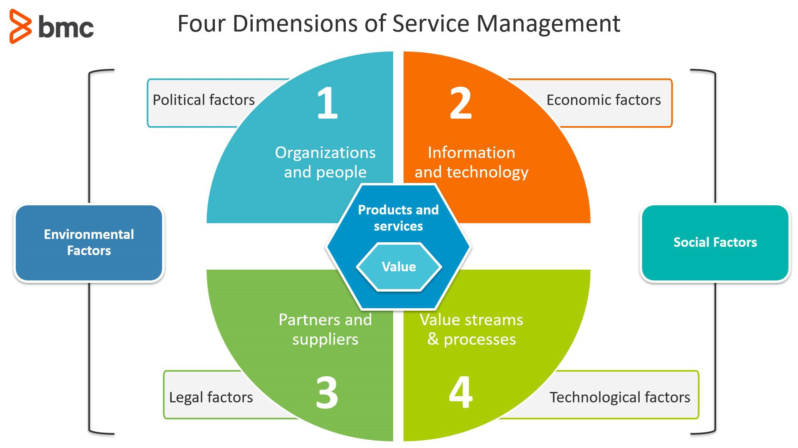

# 人员、流程、技术（和合作伙伴）：简介

当我在千禧年之初第一次接触ITIL框架时，我们被敦促在研究IT支持的服务时要考虑人、流程和技术。这被称为PPT框架或金三角。

[ITIL 4](https://www.bmc.com/blogs/itil-4/)扩大了这一观点，将合作伙伴加入其中。现在，IT服务管理的四个关键要素构成了ITIL四个方面的基础：组织和人员、价值流和流程、信息和技术、以及合作伙伴和供应商。

无论你是完全实施ITIL 4，还是将其作为众多工具中的一种来告知你的IT服务管理策略，在设计新服务或对现有服务进行修改时，你都必须考虑所有四个维度。在这篇文章中，我们将看到：

- 最初的PPT框架和它为什么会改变
- 四个维度中的每一个对价值交付都至关重要
- 可操作的最佳实践

## 金三角不再存在？

传统上，公司以各种方式处理IT服务交付问题，从临时性的到结构性的，有些努力比其他的更成功。随着时间的推移，出现了 "金三角"方法，旨在通过对某些因素的[优先排序](https://www.smartsheet.com/content/people-process-technology)来指导企业的决策。公司经常背诵PPT的方法：

- 人员第一
- 流程第二
- 技术第三

当然，今天我们做生意的方式有所不同。互联网和云计算已经彻底改变了一切，包括服务和价值交付。有机地，第四个维度出现了：**合作伙伴**。我们与第三方合作伙伴和供应商的关系意味着更多的组织可以提供价值，而不一定要成为一个技术企业。

有些人认为，金三角已经死了，最好的办法是重新规划我们对人员、流程和技术的思考，包括合作伙伴。这种新方法不是将一个维度置于其他维度之上，而是将我们引入多维度的思考，在设计或改变我们的服务时考虑每个维度。

## 人

这一点位居榜首，是有原因的。在新西兰，我们有一句毛利语与此相关。

"He aha te mea nui o te ao. He tāngata, he tāngata, he tāngata"。

这句话翻译成 "世界上最重要的东西是什么？是人，是人，是人"。没有人和他们组成的组织，你就没有服务。

当IT成为你日常关注的焦点时，你很容易忽视我们做这些工作的真正原因。技术的存在只是为了给你的企业服务的人提供价值。这就是为什么你所做的每一个决定和你所设计或改变的每一项服务都必须以你的员工为中心--如果对你的客户没有价值，你为什么要这样做？

**最佳做法：**在设计一项服务时，要始终考虑谁会使用这项服务，包括他们在哪里、什么时候、以及如何使用。你的服务必须为其用户提供什么价值？你怎样才能确保这一点得到实现？

## 流程

我们的流程阐明了服务管理的 "如何"方面。为了向客户提供预期的价值，我们要做什么？根据定义，流程是可重复的。它们每次都会产生相同的结果，不管是谁在执行它们。

我的经验告诉我，我们在流程方面让自己失望。定义和记录流程的工作最初往往做得很好，但所产生的文件却随着时间的推移而退化，变得毫无用处。很多时候，企业会投入大量的资金，请顾问来帮助设计流程，目的是为了提高交付给企业的价值。除了少数例外，这些流程在被遵循的情况下，会完全做到它们所要做的。

问题是，我们所处的世界并不是一成不变的。技术在变化，组织在重组，我们的流程也需要重新设计、改进，或者（有时）完全改变，以便继续提供价值。一个完善的持续改进实践是减轻这种风险的关键。

**最佳实践：**如果人们不遵守你的流程，就从重新评估你的流程开始，而不是你的人。确保你的流程仍然适合于目的，并且它们没有超过其使用期限。

## 技术

我们采用的技术是我们价值体系的关键组成部分。技术是现代组织中几乎所有价值的主要传递途径；现在，所有的服务在某种程度上都是由技术促成的。技术的不断变化和改进对服务的提供提出了新的挑战。

每个人都想拥有最新的闪亮的装备，但必须从商业价值的角度来考虑便利性，有时甚至是纯粹的新颖性。一台更快的服务器，一台功能丰富的笔记本电脑，或者一台能歌善舞的移动设备，会对价值的获取产生积极还是消极的影响？在升级之前，先做个计算。

**最佳做法：**在考虑技术层面的同时，还要考虑人的层面。过时的技术会造成不快乐的人，而不快乐的人不像快乐的人那样有生产力！如果你能提高员工的士气，那么你就会有更多的机会。如果你能通过为员工提供最新的移动解决方案来提高他们的士气，即使金额看起来不相上下，你也可能实现价值。

## 合作伙伴

现在回到街区的新孩子，我们的合作伙伴。作为ITIL 4中的第四个维度，我们的合作伙伴应该在阳光下有自己的位置。但是，为什么要转变为包括合作伙伴和供应商维度？这是一个简单的问题：如果没有我们的合作伙伴和供应商网络的合作，很少有IT服务可以被交付。当然，合作伙伴促进了服务的交付，但ITIL 4也鼓励我们在设计阶段就考虑合作伙伴和供应商可能给服务带来的任何限制或约束。

当我刚开始从事服务管理时，我们需要在服务交付的各个部分与第三方接触，但他们并没有重要的长期参与。他们为我们提供硬件，也许帮助我们设置，然后就离开了门。我们很少有密切的供应商关系，这根本没有必要。

在过去的几年里，情况发生了很大的变化。服务产品的指数级增长使我们能够消费我们需要的东西，而不是更多，降低或取消了资本支出预算项目，转移风险和许多合规活动。今天，我们的合作伙伴使我们能够继续为我们的客户提供价值，而不是每个企业都需要成为一个技术公司。

然而，伙伴关系并不是简单地签署、支付和交付。我遇到的最常见的错误之一是支持协议根本无法保证，因为你的合作伙伴协议没有被适当考虑。协调供应商并确保我们建立互利的关系是现代ITSM必须完善的新技能，以便为客户提供真正的价值。

最佳实践。向合作伙伴购买服务并不能消除对内部服务管理能力的需求。ITSM功能的方式可能会改变，但对内部管理的需求仍然和我们自己的服务器群和开发团队一样真实。从你的客户的角度来看，供应商的关系应该是无形的，你的组织的服务管理提供管道并确保价值交付。

## 尽管有自动化，人仍然是必不可少的

随着我们的世界继续朝着自动化的方向发展，你可能会认为服务中人的重要性正在降低--不要被愚弄。人不会从等式中消失，而且应该永远是我们的首要考虑。

Ref: https://www.bmc.com/blogs/people-process-technology/

