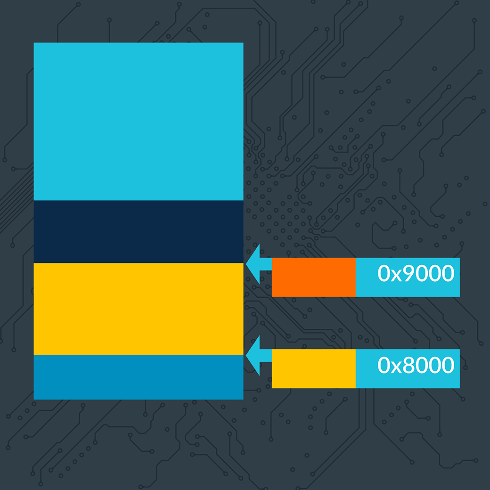

ARM MTE

内存标记

Armv8.5-A 合并了一项称为内存标记的新功能。 使用内存标记时，会为每个内存分配分配一个标记。 所有对内存的访问都必须通过带有正确标签的指针进行。 错误标签的使用会被记录下来，操作系统可以选择立即将其报告给用户，或者记录它发生的过程，以供以后调查。

例如，在下图中，对 0x8000 处的内存的访问将起作用，因为用于进行访问的指针与正在访问的内存具有相同的标记（由颜色表示）。 但是，访问 0x9000 将失败，因为该指针与内存具有不同的标记。 

内存标记可用于多种场景。 在开发过程中，可用于检测测试环境中的内存错误。 应用程序部署后，可用于检测现场问题，并向开发人员提供反馈。 一旦收到反馈，就可以在漏洞被攻击者利用之前对其进行分析和解决。 

Ref:

* [ARM Architectures](ARM_Architectures.md)

* [Arm A-Profile Architecture Developments 2018: Armv8.5-A](https://community.arm.com/arm-community-blogs/b/architectures-and-processors-blog/posts/arm-a-profile-architecture-2018-developments-armv85a)

