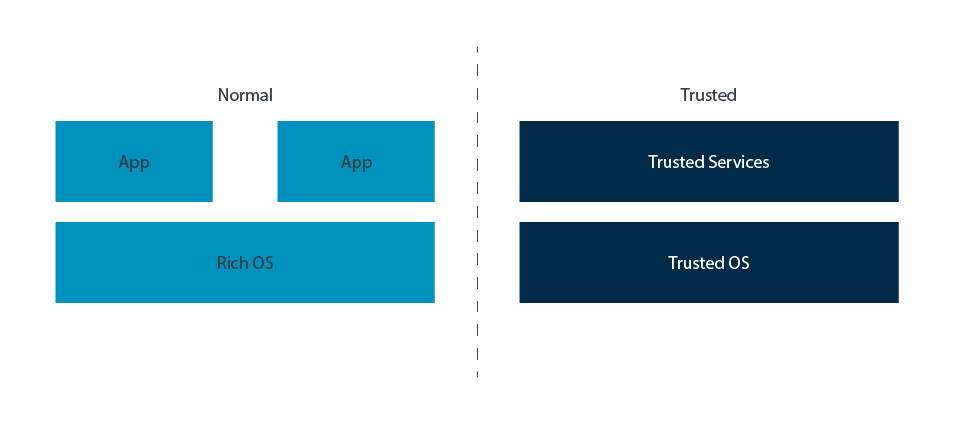
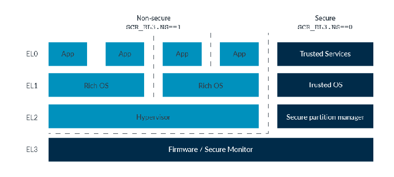

什么是TrustZone

TrustZone 是 Arm A-profile 架构中安全架构的名称。 首次在 Armv6K 中引入，Armv7-A 和 Armv8-A 也支持 TrustZone。 TrustZone 提供了两个执行环境，它们之间具有系统范围的硬件强制隔离，如下图所示： 

普通世界运行着丰富的软件堆栈。该软件堆栈通常包括一个大型应用程序集、一个复杂的操作系统（如 Linux），可能还有一个管理程序。此类软件堆栈庞大且复杂。虽然可以努力保护它们，但攻击面的大小意味着它们更容易受到攻击。

可信世界运行一个更小、更简单的软件堆栈，称为可信执行环境 (TEE)。通常，一个 TEE 包括多个由轻量级内核托管的可信服务。可信服务提供诸如密钥管理之类的功能。该软件堆栈的攻击面要小得多，这有助于减少攻击的脆弱性。

注意您有时可能会看到术语富执行环境 (REE) 用于描述在正常世界中运行的软件。

TrustZone 旨在平方一个圆。作为用户和开发人员，我们希望拥有 Normal 世界的丰富功能集和灵活性。同时，我们希望在 Trusted 世界中使用更小、更受限制的软件堆栈可以实现更高程度的信任。 TrustZone 为我们提供了两者，为两个环境提供了它们之间的硬件强制隔离。

## 用于 Armv8-M 的 TrustZone

TrustZone 还用于指代 Armv8-M 架构中的安全扩展。虽然 A 配置文件架构和 M 配置文件架构中的 TrustZone 之间存在相似之处，但也存在重要差异。本指南仅涵盖 A 配置文件。 

## 处理器中的可信隔区(TrustZone)

ARM架构中，分为两种安全状态：安全和非安全。对应可信环境和普通环境。

在EL0、EL1和EL2层级，处理器可以在两种状态。以SCR_EL3.NS位标识。

    NS.EL1: Non-secure state, Exception level 1
    S.EL1: Secure state, Exception level 1

