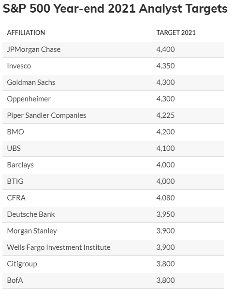
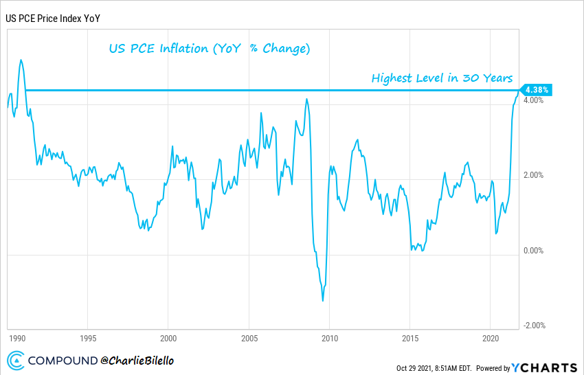

# 如何在不知道未来的情况下投资

又到了每年的这个时候。

关于 2022 年市场走向的无尽**预测**和**价格目标**：

- 标准普尔 500 指数将___。

- 10 年期国债收益率将___。

- 原油将___。

- 比特币将___。

这种类型的内容有大量观众，但它有什么价值吗？

只有你相信专家可以准确预测未来，而且他们在这方面的记录并不是特别好。今年是另一个例子......

标准普尔 500 指数在 2021 年创下 65 个历史新高，同比上涨超过 25%。

到 2020 年底，有多少权威专家预测了这些收益？

完全没有。在主要华尔街机构中，4,400 点的最高目标价比标准普尔 500 指数今天的交易价格（4,700 点）低 300 点。

股市并不是今年唯一的惊喜。油价在去年跌至每桶 80 美元以上，比特币在去年翻了两番后翻了一番多，美国通胀率处于 30 年来的最高水平。

在今年年初，这些事情都不是人们普遍预期或可预测的。然而，我们今天在这里，再次展示了预测业务的徒劳。

**但如果你不能预测未来，你怎么投资？你不需要知道接下来会发生什么吗？**

这可能看起来违反直觉，但事实并非如此。事实上，承认你不知道市场走向通常是你作为投资者能做的最好的事情。

为什么？

因为它会引导您使您的投资组合多样化，并为可能出现的**许多可能结果**做好准备。

哪些潜在结果可能会让市场参与者感到意外？我今天能想到一些突出的......

## 1) 美股表现不佳

十多年来，美国股市一直领先于全球同行，而且幅度很大。由于无休止的财政刺激和超宽松的美联储，很难想象这种情况不会继续下去。

## 2）增长类个股相对价值类表现不佳

十多年来，增长类个股的表现一直优于价值。当今最大和最受尊敬的公司都属于成长型公司：苹果、亚马逊、谷歌和微软。很难想象这些股票不会继续占据主导地位的情景。

## 3）追求收益率会受到惩罚

垃圾债券收益率在 2021 年跌至历史低点，有史以来首次跌破 4%。违约率很低，经济正在蓬勃发展，一旦出现麻烦的迹象，预计美联储将像 2020 年那样出手挽救局面。由于 0% 的利率仍然有效，很难想象一种情况收益没有回报。

## 4) 大盘股跑输大盘

在过去十年中，大盘股击败了小公司，因此很难想象未来的领导层会发生变化。

## 5）更高的通货膨胀不是暂时的

在过去的 20 年里，美国的核心通货膨胀率平均每年为 2%，每年几乎没有变化。美联储和联邦政府都表示，今年增加到超过 4% 是暂时的，并将立即回落到 2%。很长一段时间以来，我们都没有看到持续的较高通胀水平，因此很难想象会发生这种情况。

如果我们知道未来十年将与过去十年完全一样，我们就可以放心地忽略这些可能的情况，并将我们的投资组合集中在美国大盘股增长股票和风险债务上，而不会接触可能受益于更高通胀的资产类别。毫无疑问，有很多人正在这样做，因为新近偏见是一股强大的力量。

但是对于那些学习市场历史和已经发生的许多曲折的人来说，有必要采取更接地气的方法。这意味着持有目前令人厌恶的资产，如新兴市场或价值股，抵制追求收益的冲动，并使您的投资组合免受持续较高通胀的可能性。

你做这些事情不是因为你知道它会很好地为你服务，而是因为它可能会很好。这是最简单形式的风险管理：谦虚地承认您不知道未来并相应地进行投资。

Ref:

[How to Invest Without Knowing the Future](https://compoundadvisors.com/2021/how-to-invest-without-knowing-the-future)

 

